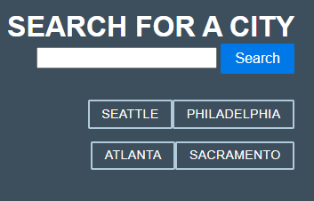
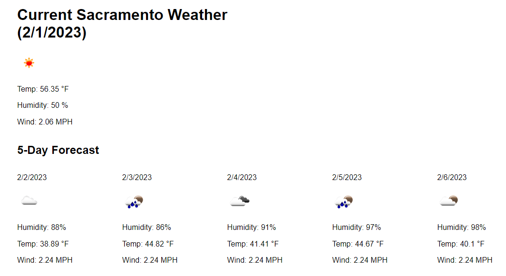

# 5-Day Weather Forecast City Search

## Description

This application provides a search functionality by city to get a 5-day weather forecast.

## Usage

[This is the live website.](https://hostile131.github.io/module-6-challenge/)

Users can utilize the search bar to search by city name, or they can select cities that they have previously searched for (some cities are pre-loaded).

Search results will bring up current weather conditions as well as a 5-day forecast.

## License

[MIT License](https://opensource.org/licenses/MIT)